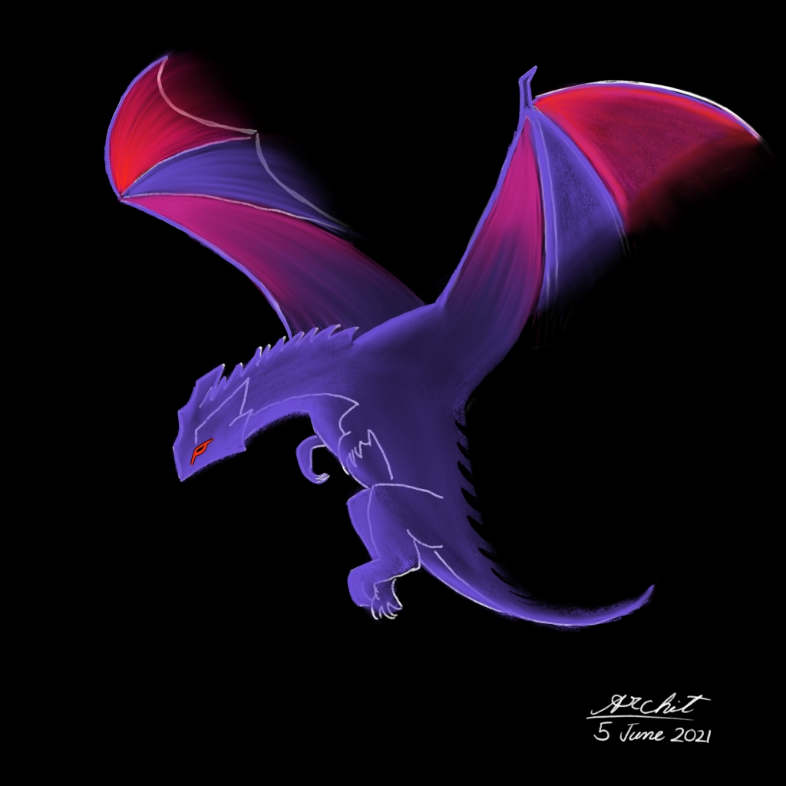
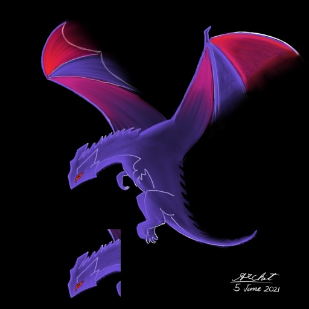
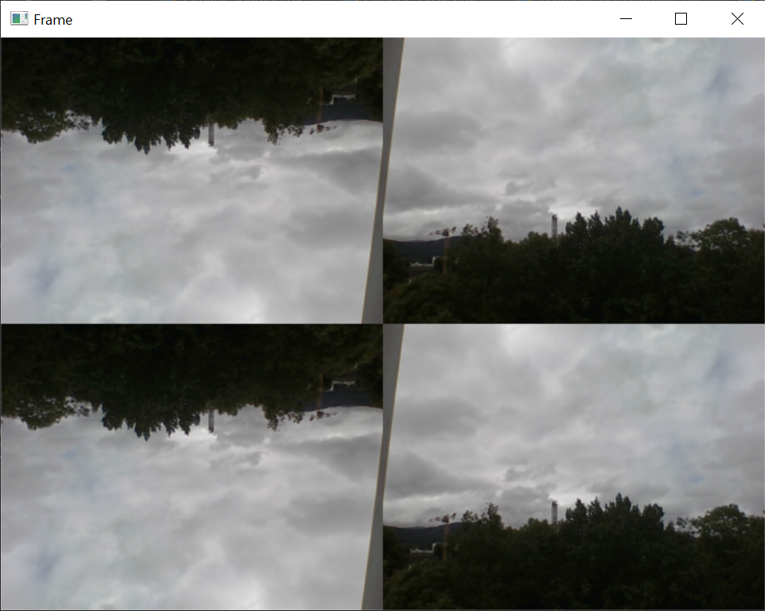
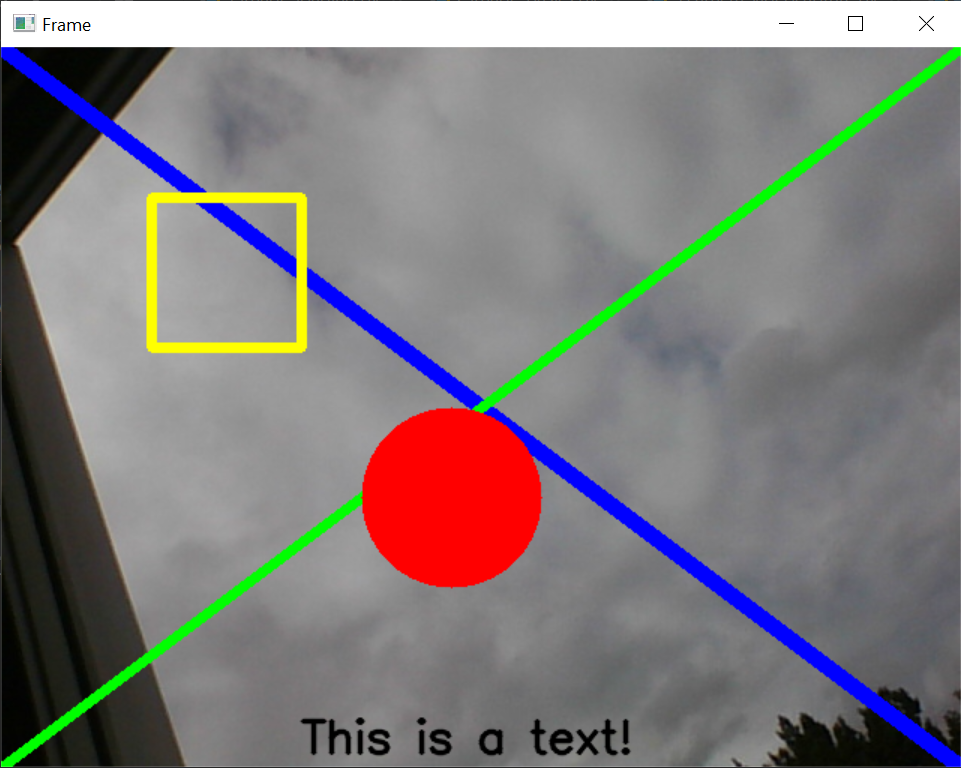
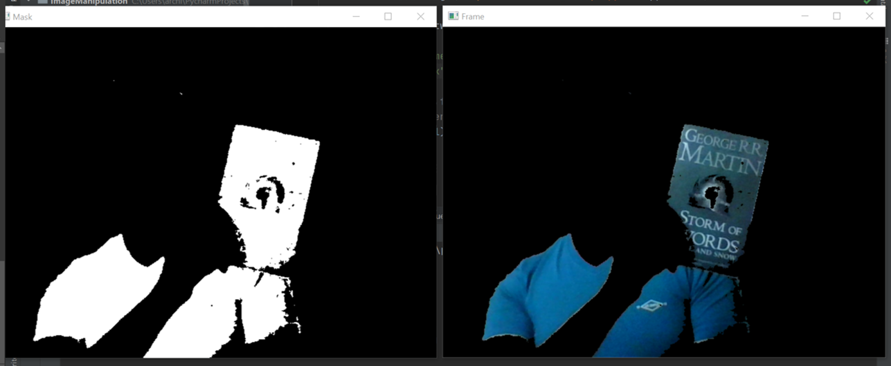

# Image Manipulation
Repository for documenting about some of the image manipulation techniques using Python and other open-source libraries.

## 1. Instance Segmentation and Object Detection

* Make use of [pixellib](https://github.com/ayoolaolafenwa/PixelLib) library
* Use of a Mask R-CNN model
    * trained on coco dataset
* Python script [here](./segment.py)
  
---

## 2. Basic Image Manipulation using Pillow

Some basic `PIL` functions for image processing

* Merge two images
* Add/subtract two images
* Convert to grayscale
* Convert to Black-and-White
* Colour Inversion
* Rotation
* Gaussian Blur
* Edge Detection

Python notebook with the above implemented operations can be accessed [here](./basic-image-pillow.ipynb).

---

## 3. OpenCV based Basic Stuff

### 3.1 [Basic image loading](./opencv-basic/1.image-loading.py)

### 3.2 [Extracting snippet of an image](./opencv-basic/2.image-basics.py)

|  |  |
|:-:|:-:|

### 3.3 [Webcam based video capture](./opencv-basic/3.camera-videocapture.py)

* Capturing webcam feed
* Multiply, manipulate and fit to grid

|  |
|:-:|

### 3.4 [Drawing and Writing on Image](./opencv-basic/4.shape-drawing.py)

* Drawing overlay shapes and text on a webcam feed
* Can be generalized to any image or video

|  |
|:-:|

### 3.5 [Colour Detection and Masking](./opencv-basic/5.colour-detection.py)

* Creating a masking image to detect a certain range of colour
* Applying mask to the video frame/image using `bitwise_and`

|  |
|:-:|